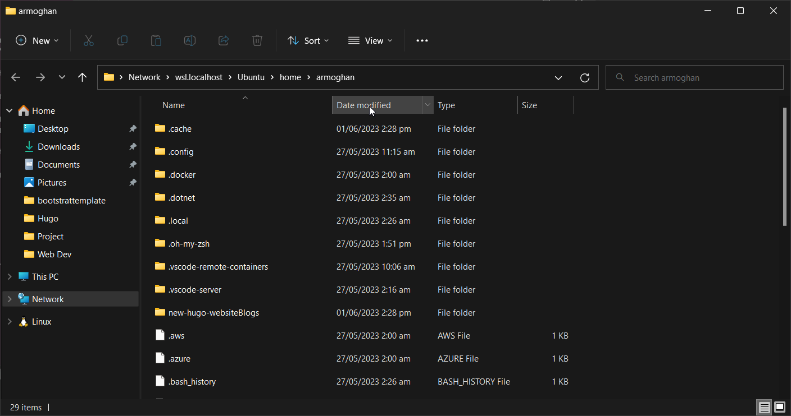
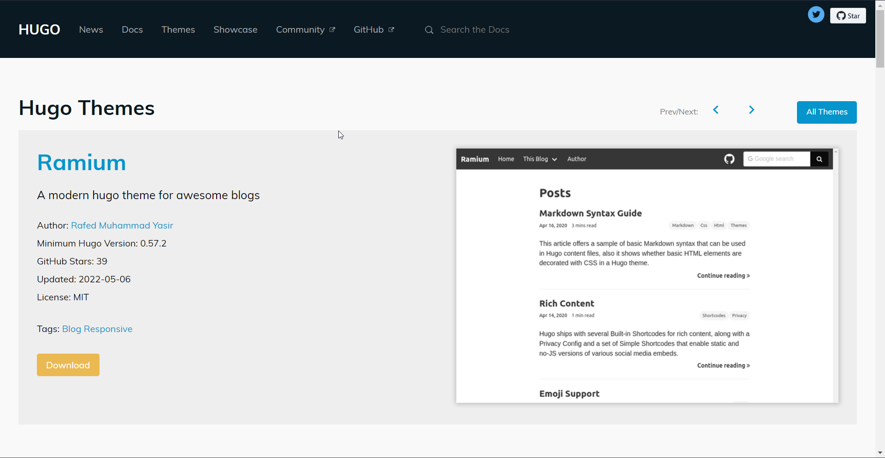
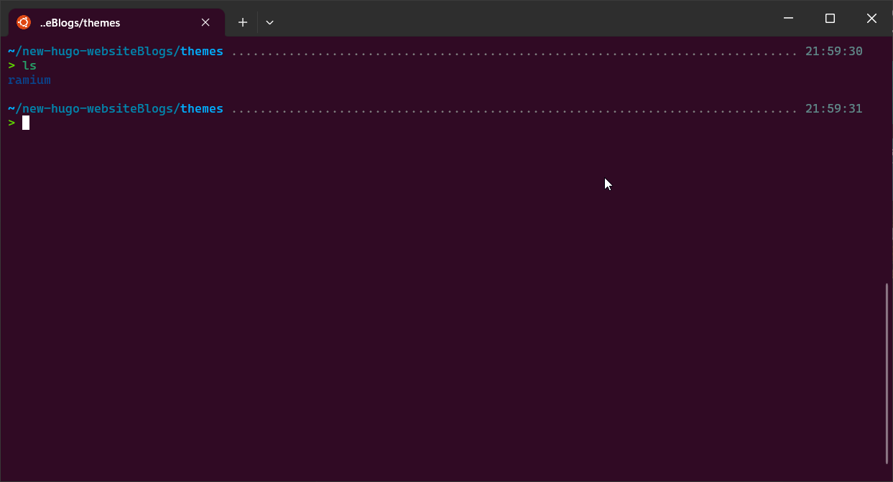
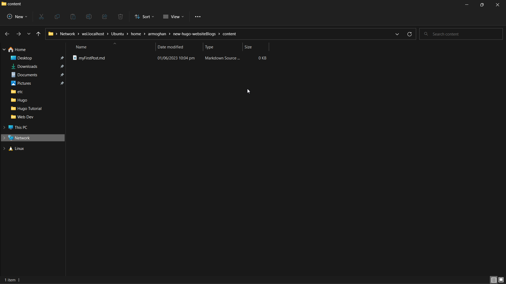

## How to Create a Hugo Project

To create a new Hugo project, you will need to use the built-in hugo new site command.

1. Open your terminal or command prompt. Navigate to the folder where you would like to create your project.
2. Execute the hugo new site command:

```bash
hugo new site new-hugo-website
```

3.Navigate to the location of your Hugo project in your file explorer.
4. Open the project folder. You will see that your new Hugo website has the file and folder structure required for your website to work.



## How to Add a Theme

At the moment, your project only contains the main base folders for the Hugo project. Running your website locally at this point would only show an empty screen. Since you do not have any HTML, CSS, or UI designs set up for your website yet, you will need to add them.

Hugo already provides a library of in-built Hugo Themes created by developers.

1. Select a theme that you like. Each theme may have slightly different set-up instructions, shown on their respective preview page. This tutorial will use the Ramium theme as an example.



2. Navigate to the root folder of your project in a terminal or command line.

```bash
cd new-hugo-website
```

3. Run the command to add the Ramium theme. You can add the theme as a submodule, which will create a new folder called Ramium inside the theme folder.

```bash
git init
git submodule add https://github.com/rafed/ramium.git themes/ramium
```

Alternatively, you can clone the GitHub Ramium repository into the themes folder of your project.

```bash
git clone https://github.com/rafed/ramium.git themes/ramium
```

4. Navigate to your project folder. Click on the themes folder to open it. Regardless of which command you used, there will be a new Ramium folder that stores the newly downloaded theme.



5. In the config.toml file, add the Ramium theme as part of the configuration. This will tell Hugo to use the HTML, CSS, and other styles that the Ramium theme includes.

```bash
    theme = "ramium"
```

## How to Add Pages to Your Website

You can write your content in any format that Hugo accepts. Hugo will then automatically convert your files into HTML files when serving them to the user. This makes it fast to both build and deploy. This example will use [Markdown, a simple plain-text language](https://armoghan-blogs.netlify.app/posts/markdown/), as the format for your content.

You can write Markdown mostly in plain English with a few added symbols to specify any formatting. This includes adding symbols to represent headings, which words are bold, or any other basic formatting that you may need.

To add a new sub-page or post to your website, you will need to add a new Markdown file into the content folder. Each post or page will have its own Markdown file associated with it.

1. Open the content folder inside your Hugo project. Create a new Markdown file called **myFirstPost.md**.



2. Open the file in any text editor such as Notepad++ or Visual Studio Code.

3. At the top of the file, add some metadata. This will include important information about the post. The theme you are using will format this information a certain way on the page

```Go

---
author: "Your Name"
title: "My First Post"
date: "2022-05-17"
---

```

4. After you have added the metadata, you can start adding your content using Markdown.

``` md
This is my very first post on my Hugo website!
The Hugo theme being used for this site is called Ramium.
It is very simple to install and configure.
# Subheading
This is some content.
# Another Subheading
This is more content.
```

5. Feel free to add more markdown files to add more pages to your website.

## How to Run and Test Your Hugo Website Locally

To run your website, use the hugo serve command.

1. Open a terminal or command line.
2. Navigate to the root folder of your Hugo project.
3. Run the hugo serve command

```bash
hugo serve
```

4. Wait for the website to complete the startup process. Once that is complete, the terminal will print a message saying which local address you can access the website from. Usually, this is <http://localhost:1313/>.


5. Open a web browser and enter <http://localhost:1313/>, or whichever address the terminal gave you. You will see the main page of your Hugo website.

## Hosting Your Hugo Website

Getting a static website up and running is simple and fast with Hugo. You can use and configure pre-built themes and run your Hugo website locally for testing. You can also add content pages to your website using Markdown.

Once you have created your Hugo website, you can start learning more about how to host it. There are many free website hosting options for you to choose from such as Dropbox, Google Drive, or OneDrive.
