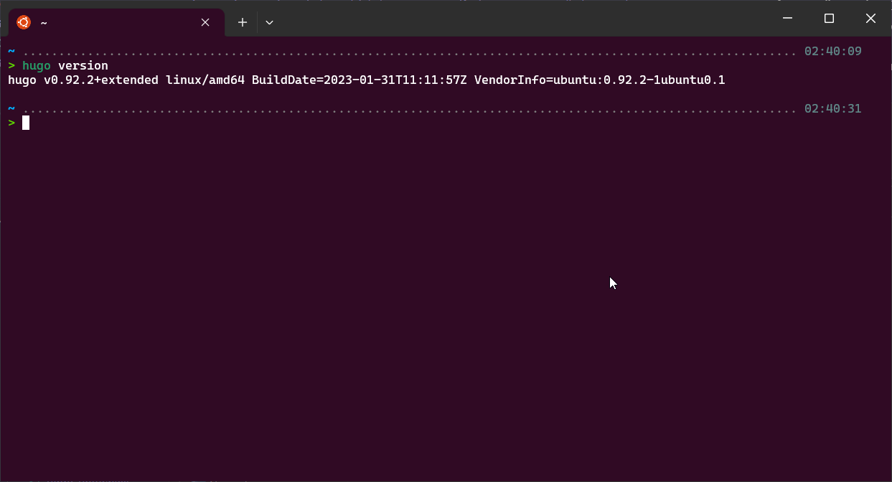
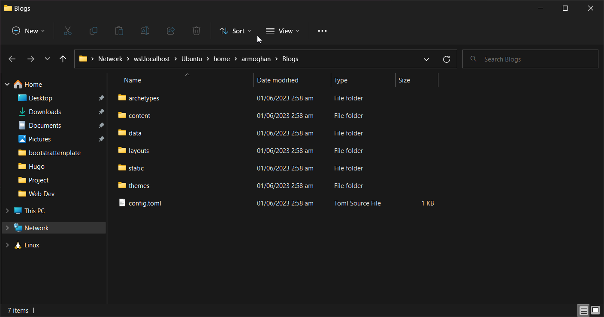

Hugo is a static site generator (SSG) written in [Go](https://kinsta.com/blog/best-programming-language-to-learn/#go) (aka Golang), a high-performance compiled programming language often used for developing backend applications and services.

Today, Hugo is capable of generating most websites within seconds (<1 ms per page). That explains why Hugo bills itself as “the world’s fastest framework for building websites.”

In this article, we’ll take a look at the history of Hugo, what makes it so fast, and how you can start building your own Hugo static site.


## What Is Hugo? And Why Is It Popular?


Steve Francia originally developed the [Hugo static site generator](https://gohugo.io/) in 2013, and Bjørn Erik Pedersen took over as the project’s lead developer in 2015. Hugo is an open-source project, which means its code can be viewed and improved on by anyone.

As a static site generator, Hugo takes Markdown content files, runs them through theme templates, and spits out HTML files that you can easily deploy online – and it does all of this extremely quickly.

In 2021, there are dozens, if not hundreds, of static generators. Every static site generator has its appeal. Jekyll is popular among Ruby developers, and while it’s not as fast as other options, it was one of the first static site generators to see widespread adoption. Gatsby is another popular SSG that’s well-suited for developing statically deployable sites that are dynamic in functionality

## Hugo Is Fast

In terms of raw performance, Hugo is the best static site generator in the world. Compared to Jekyll, Hugo was shown to be 35x faster by Forestry. Similarly, Hugo can render a 10,000-page site in 10 seconds, a task that would take Gatsby over half an hour to complete. Not only is Hugo the fastest SSG in terms of build times, but it’s also quick to install.

Hugo ships as a self-contained executable, unlike Jekyll, Gatsby, and other SSGs requiring installing dependencies with a package manager. This means you can download and use Hugo immediately without having to worry about software dependencies.

## Templating Is Easy in Hugo

In SSG lingo, “templating” refers to the process of adding placeholders for dynamic content insertion within an HTML page. To access the title of a page, you can use the {{ .Title }} variable. Thus, within a Hugo HTML template, it’s common to see the {{ .Title }} wrapped in H1 tags like so:

``` html
<h1>{{ .Title }}</h1>
```

At build time, Hugo will automatically grab the title within a content file and insert the title between the two ``<h1>`` tags. Hugo has a variety of built-in templating variables, and you can even write custom functions to process data at build time. For templating, Hugo uses Go’s built-in html/template and text/template libraries. This helps cut down on application bloat because Hugo doesn’t need to install third-party libraries for templating.

## How to Install Hugo

Hugo ships as a compiled executable, which means you won’t have to download and manage many dependencies just to get started. It’s available for macOS, Windows, and Linux.

## How to Install Hugo on macOS and Linux

The recommended installation method for macOS and Linux requires Homebrew, a package manager for installation and updating applications. If you don’t already have Homebrew installed, you can install it by running the command below in Terminal:

``` bash
/bin/bash -c "$(curl -fsSL https://raw.githubusercontent.com/Homebrew/install/HEAD/install.sh)"
```

After Homebrew has been installed, run the command below to install Hugo:

``` bash
brew install hugo
```

## How to Install Hugo on Windows

For Windows users, Hugo can be installed using either the Chocolatey or Scoop package managers. Since the instructions for installing Chocolatey and Scoop are a bit more complex than Homebrew, we recommend referring to their official documentation pages here and here.

After installing either Chocolatey or Scoop, you can install Hugo using one of the following commands (depending on your package manager):

```ps1
choco install hugo-extended -confirm
```

<br>

```ps1
scoop install hugo-extended
```

## How to Verify that Hugo Is Installed Correctly

To verify that Hugo has been correctly installed, run the following command:

```ps1
hugo version
```

This Terminal command should output information regarding the currently installed version of Hugo like so:


## Hugo Commands and Configuration

Before we dive into creating a static site with Hugo, let’s get familiar with its various CLI commands and configuration file parameters.

### Hugo CLI Commands

* `hugo check` – runs various verification checks
* `hugo config` – displays the configuration for a Hugo site
* `hugo convert` – converts content to different formats
* `hugo deploy` – deploys your site to a cloud provider
* `hugo env` – displays the Hugo version and environment information
* `hugo gen` – provides access to various generators
* `hugo help` – displays information about a command
* `hugo import` – lets you import a site from another location
* `hugo list` – displays a list of various content types
* `hugo mod` – provides access to various module helpers
* `hugo new` – lets you create new content for your site
* `hugo server` – starts a local development server
* `hugo version` – displays the current Hugo version

The Hugo CLI also has a variety of flags to specify additional options for some commands. To view a complete list of Hugo flags (there are a lot of them), we recommend using the ``hugo help`` command to display a list of all the available flags.

### The Hugo Configuration File

Hugo’s configuration file supports three formats: ``YAML``,``TOML``, and ``JSON``. Likewise, the Hugo configuration file is **config.yml**, **config.toml**, or **config.json**, and you can find it in the root directory of a Hugo project.



Here’s what a typical Hugo configuration file in YAML format looks like

```toml
baseURL = 'http://example.org/'
languageCode = 'en-us'
title = 'My New Hugo Site'
```

If you’ve used WordPress or another CMS before, some of the configuration options may look familiar to you. For example, ``armoghan's-static-site`` is the name of the site’s theme, ``armoghan's Static Site``is the SEO meta title, and paginate (the number of posts per page) is 5.

Hugo has dozens of configuration options, all of which you can explore in the official Hugo documentation. If you need to make any global configuration change while developing a Hugo site, chances are you’ll need to edit this configuration file.
