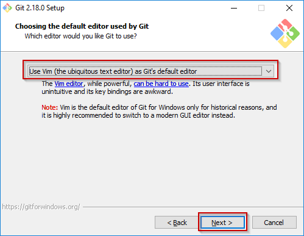

## Install Git On Windows

This article will guide you on how to install Git command line tools along with Git Bash, which is a terminal shell which will allow you to use UNIX terminal commands and utilities on your Windows operating system.

You can find the Windows installer available for download here: https://git-scm.com/download/win


Your download should start automatically, but if it doesn't for some reason, you can follow the If your download hasn't started, click here to download manually. link.


After the download finishes, run the Git .exe installation file (press **Yes/Run** when the Window security dialog pops up)

1) Click the **Next** button after reading the terms and conditions in the initial installation window.

1) Leave the default installation path and click **Next** to continue.

1) You can tick the 'On the Desktop' icon option and leave other selected components as default, and again press **Next** to continue.

1) Remember the Start Menu folder which will be created for Git and Git Bash, you can use the shortcuts there to start the tools.

1) You can leave the **Vim** as Git's default editor, unless you want to change it to your code editor from the dropdown menu.

1) Choose the **Use Git and optional Unix tools from the Windows Command Prompt** on the bottom and click **Next** to proceed.

1) Keep clicking **Next** and leave all the predefined installer settings until the installation process starts.

1) Press **Finish** to complete the installation process.

1) Now you can start your Git Bash by clicking the desktop shortcut or via the Windows Start Menu.

You can check verify that git command line tools were properly installed by typing **git --version** in the Git Bash terminal.



To find more information about the commands and tools available via Git and Git Bash, check these links:
1. <a href="https://www.codeproject.com/Articles/457305/Basic-Git-Command-Line-Reference-for-Windows-Users">https://www.codeproject.com/Articles/457305/Basic-Git-Command-Line-Reference-for-Windows-Users</a>
<br>
2. <a href="https://education.github.com/git-cheat-sheet-education.pdf">https://education.github.com/git-cheat-sheet-education.pdf</a>



## Install Git On Mac 

Most versions of MacOS will already have Git installed, and you can activate it through the terminal with git version. However, if you don't have Git installed for whatever reason, you can install the latest version of Git using one of several popular methods as listed below:


### Install Git using the Mac Installer

**Step 1.** Open a browser and navigate to Git's official website. <br>
**Step 2.** When you enter the page, you will see the version number and a download button.


**Step 3.** Upon choosing Download, your computer will begin to automatically download the software package once you click on it. <br>
**Step 4.** The Git installer can be opened by double-clicking it to begin the installation process. <br>
**Step 5.** Set up Git according to the setup guide. Version control systems should be left in their default settings if you are new to them. <br>
**Step 6.** When prompted, enter your password when installing the program. <br>
**Step 7.** Ensure that the installation was successful by clicking the Install Software button again. <br>

### Install Git with Homebrew

Homebrew simplifies the installation of software on Apple's operating system (macOS) using a free, open-source software package management system. It can be used to install any type of package you will need in the future, not just Git. It is extremely useful because of this.

Installing Homebrew does not require any applications or anything else. To install Homebrew, simply open the terminal and run these commands

``` bash
$ /bin/bash -c "$(curl -fsSL https://raw.githubusercontent.com/Homebrew/install/HEAD/install.sh"
```


**Note** − Your password will be requested once you enter the command.


As soon as that is complete, you can install Git in your terminal by using the command below
``` bash
$ brew install git
```

Upon successful installation, your Mac will have Git installed. You can verify by running the following command
``` bash
$ Git --version
``` 

## Install Git On Linux

If you want to install the basic Git tools on Linux via a binary installer, you can generally do so through the package management tool that comes with your distribution. If you’re on Fedora (or any closely-related RPM-based distribution, such as RHEL or CentOS), you can use `dnf`:
``` bash
$ sudo dnf install git-all
```

If you’re on a Debian-based distribution, such as Ubuntu, try `apt`:
``` bash
$ sudo apt install git-all
``` 
For more options, there are instructions for installing on several different Unix distributions on the Git website, at https://git-scm.com/download/linux.
