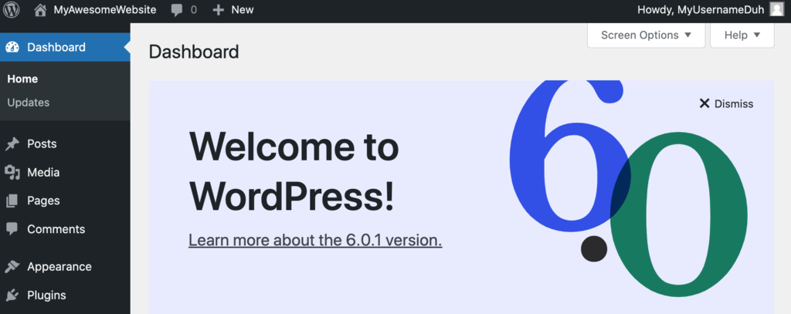

Setting up an isolated environment for developing WordPress websites can initially seem challenging. Luckily, containerization tools like Docker exist, which help to streamline the development, testing, and deployment processes.

This tutorial will show you how to install and deploy a local WordPress site on a Docker container.


## What Exactly Is Docker

Docker is an open-source containerization software that creates isolated environments to run various applications. Users can develop, test, and run multiple applications on the same physical and virtual servers.

Unlike virtual machines, each container does not require its own OS as it shares the host kernel. Thus, the machine’s workload is much more lightweight, and such a server can run multiple containers simultaneously without losing performance.

For example, Docker is highly useful for WordPress developers. A WordPress test environment usually uses up a lot of system resources, while Docker allows developers to make a minimal environment without wasting server space and memory.

## How to Deploy WordPress Image as a Docker Container

The following steps will show you how to install a WordPress content management system on a Docker container.

## Step 1 – Install Docker

Docker is available for Windows, macOS, and Ubuntu. Here’s how you can install it on any of the three operating systems:

### How to Install Docker on Ubuntu

In order to install Docker on a Linux VPS, you need to have a virtual private server (VPS) with one of the following operating systems:

* Ubuntu Jammy 22.04 (LTS)
* Ubuntu Impish 21.10
* Ubuntu Focal 20.04 (LTS)
* Ubuntu Bionic 18.04 (LTS)

Now, just follow the steps as shown:

1. Update the package list:

```bash
sudo apt-get update 
```

2. Install the required packages:

```bash
sudo apt-get install ca-certificates curl gnupg lsb-release
```

3. Create a directory for the Docker GPG key:

```bash
sudo mkdir -p /etc/apt/keyrings
```

4. Add Docker’s GPG key:

```bash
curl -fsSL https://download.docker.com/linux/ubuntu/gpg | sudo gpg --dearmor -o /etc/apt/keyrings/docker.gpg
```

5. Set up the repository:

```bash
echo \ "deb [arch=$(dpkg --print-architecture) signed-by=/etc/apt/keyrings/docker.gpg] https://download.docker.com/linux/ubuntu \ $(lsb_release -cs) stable" | sudo tee /etc/apt/sources.list.d/docker.list > /dev/null
```

6. Update Docker’s repository:

```bash
sudo apt-get update
```

7. Lastly, install the latest version of Docker Engine, containerd, and Docker Compose.

```bash
sudo apt-get install docker-ce docker-ce-cli containerd.io docker-compose-plugin
```

7. To confirm that the installation process was successful, run the following command. The following success message should appear:

```bash
sudo docker run hello-world
```


### How to Install Docker on macOS

In order to install Docker on a macOS machine, these requirements must be met:

* 4 GB of RAM
* macOS version 10.15 or newer
* No previous versions of VirtualBox 4.3.30 can be installed

Here’s how you can install Docker on macOS:

1. Download Docker for Mac and double-click the .dmg file you’ve saved. Then, drag and drop the Docker icon into your Applications folder.


You can find download links here:

* [Mac with an Apple processor](https://desktop.docker.com/mac/main/arm64/Docker.dmg)
* [Mac with an Intel processor](https://desktop.docker.com/mac/main/amd64/Docker.dmg)

2. Open your Applications folder and double-click docker.app. During the configuration process, you’ll be asked to enter your password.


3. When prompted, Accept the service agreement; otherwise, the installation will fail.


4. Once the installation process is finished, you should see the Docker menu on your desktop’s status bar

### How to Install Docker on Windows

In order to install Docker Desktop on a Windows machine, these requirements must be met:

* 4 GB of RAM
* 64-bit processor from 2010 or more recent
* Virtualization enabled in BIOS
* Linux kernel update package installed if you are using the WSL 2 Docker back-end

Here’s how you can install Docker on Windows 10 64-bit:

1. Enable Hyper-V on your system.
2. Download Docker Desktop for Windows and open the Docker for Windows Installer file.
3. In the Configuration dialog window, check the boxes based on your preferences. Click Ok.


4. Once the installation is finished, click Close and restart and wait for your computer to reboot.


5. After reboot, Accept the service agreement, and Docker will be ready to use.


## Step 2 – Set Up WordPress Container on Docker

In order to set up WordPress on Docker, two methods are available ‒ the CLI and Docker compose. In this tutorial, we will use the Docker compose method as it’s more straightforward and systematic.

It’s worth noting that all required images are acquired from **Docker Hub**:

* [WordPress](https://hub.docker.com/_/wordpress) – the official WordPress Docker image. Includes all WordPress files, Apache server, and PHP.
* [MySQL](https://hub.docker.com/_/mysql) – required for MySQL root user, password, and database connection variables.
* [phpMyAdmin](https://hub.docker.com/_/phpmyadmin) – a web application for managing databases.
Open your operating system’s preferred command line interface and check the

Docker Compose Installation version:

```bash
docker compose version
```

This will confirm that the Compose module is working correctly.

2. Create a new project directory for WordPress application with the following command:

```bash
mkdir wordpress
```

3. Navigate to the new directory:

```bash
cd wordpress
```

4. Using your preferred text editor, create a new docker-compose.yml file, and paste the contents below:

```yml
version: "3" 
# Defines which compose version to use
services:
  # Services line define which Docker images to run. In this case, it will be MySQL server and WordPress image.
  db:
    image: mysql:5.7
    # image: mysql:5.7 indicates the MySQL database container image from Docker Hub used in this installation.
    restart: always
    environment:
      MYSQL_ROOT_PASSWORD: MyR00tMySQLPa$$5w0rD
      MYSQL_DATABASE: MyWordPressDatabaseName
      MYSQL_USER: MyWordPressUser
      MYSQL_PASSWORD: Pa$$5w0rD
      # Previous four lines define the main variables needed for the MySQL container to work: database, database username, database user password, and the MySQL root password.
  wordpress:
    depends_on:
      - db
    image: wordpress:latest
    restart: always
    # Restart line controls the restart mode, meaning if the container stops running for any reason, it will restart the process immediately.
    ports:
      - "8000:80"
      # The previous line defines the port that the WordPress container will use. After successful installation, the full path will look like this: http://localhost:8000
    environment:
      WORDPRESS_DB_HOST: db:3306
      WORDPRESS_DB_USER: MyWordPressUser
      WORDPRESS_DB_PASSWORD: Pa$$5w0rD
      WORDPRESS_DB_NAME: MyWordPressDatabaseName
# Similar to MySQL image variables, the last four lines define the main variables needed for the WordPress container to work properly with the MySQL container.
    volumes:
      ["./:/var/www/html"]
volumes:
  mysql: {}
```

5. With the Docker Compose file created, run the following command in the same wordpress directory to create and start the containers:

```bash
docker compose up -d
```

## Step 3 – Complete WordPress Installation on a Web Browser

Open your browser and enter **`http://localhost:8000/`**. WordPress setup screen will appear. Select the preferred language and continue.


Fill in your site name, username, password, and email.


When a Success! message pops-up, log in using your newly created details.


Lastly, you’ll be presented with the main WordPress dashboard screen.



### Setting up phpMyAdmin

phpMyAdmin is a great tool for viewing and managing any existing databases. All you need to do is include these lines to an existing .yml file just after the services line along with the MySQL database service:

```yml
version: "3"
services:
  db:
    image: mysql:5.7
    restart: always
    environment:
      MYSQL_ROOT_PASSWORD: MyR00tMySQLPa$$5w0rD
      MYSQL_DATABASE: MyWordPressDatabaseName
      MYSQL_USER: MyWordPressUser
      MYSQL_PASSWORD: Pa$$5w0rD
  phpmyadmin:
    image: phpmyadmin/phpmyadmin:latest
    restart: always
    environment:
      PMA_HOST: db
      PMA_USER: MyWordPressUser
      PMA_PASSWORD: Pa$$5w0rD
    ports:
      - "8080:80"
```

Save the file and run the docker-compose Docker command:

```bash
docker compose up -d
```

Once done, open **``http://localhost:8080/``**, and you’ll be able to see the phpMyAdmin interface along with your WordPress database.


