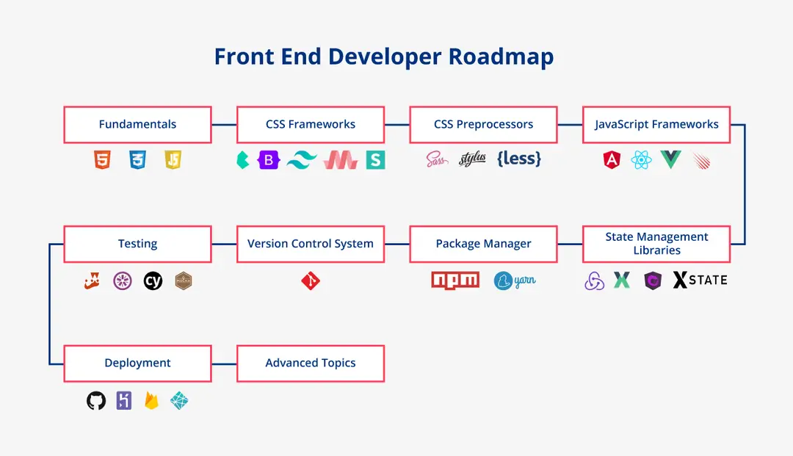

Front-end development, or client-side development, involves building the User Interface (UI) of a website or a web application, that determines how every part of a website will look and how it will work. The UI includes the visual part of the application and the user interactions. Whatever you see when you visit a website - the different types of buttons and other UI components, media, texts, forms, animations, etc. are all developed as a part of the front-end.   

A Front-End Developer is a type of Software Engineer who works on front-end development. They are not only responsible for developing the UI, but they also ensure a balance between design and functionality and ensure speed and scalability. They also ensure that the website loads correctly on all browsers (cross-browser), on different operating systems (cross-platform), and on different devices like mobiles, tablets, and computer screens (cross-device). 

If you are serious about becoming a Front End Developer, you can start by signing up for the best Full Stack Development course.       

The tools and technologies that are used to develop the front-end of a website change constantly. The plethora of these front-end tools and frameworks often confuses beginners who are trying to step into the front end because they are unsure of what they need to learn. If you want to become a Front-End Developer and don’t know where to start, this is the right place for you. In this article, we will look at what tools, technologies, frameworks, and programming languages you need to learn. We will cover the Front End Developer roadmap. You might also find it interesting to read about the top reasons to become a full stack developer article 

Note that the front end development roadmap presented in this article is not the only way to become a Front End Developer. This is simply a guide for those who are looking to start learning Front End Development.


## Fundamentals of Front End 
For stepping into Front-End Development, the most essential skills you should have are HTML, CSS, and JavaScript. These skills are the bare minimum to start with Front-End Development. Note that front-end web development is not just limited to these three skills, there are many more technologies that you will need to learn to excel as a Front-End Developer in 2023. 

Let us look at these fundamental skills in detail.

### 1. HTML - HyperText Markup Language   
HTML stands for HyperText Markup Language. It is used to form the “skeleton”, or the base, of any website. It lays out a website’s general structure and content. The elements that you see on the screen - buttons, images, sliders, date pickers, texts, lists, etc. are all added using HTML.  

This markup language is made up of tags that label or indicate what the content should appear as. For example, let us look at the code snippet below
``` HTML
<!DOCTYPE html> 
<html> 
          <head> 
                    <title> My Website </title> 
          </head> 
          <body> 
                    <h1> This is heading level 1 </h1> 
                    <h2> This is heading level 2 </h2> 
                    <p> This is a normal paragraph </p> 
                    <i> This text will be italicized </i> 
                    <button> Click Me! </button> 
          </body> 
</html> 
```
**In the above snippet:**

* <!DOCTYPE html> is a declaration that should be added at the start of every HTML document to indicate to the browser what type of document to expect, i.e. HTML. 
The HTML opening tag (<html>) and the HTML closing tag (</html>) indicate the start and end of a HTML structure.  
* The “head” tags (<head> and </head>) contain the metadata or information about the website. Not all of the metadata is visible on the website, some of them are information for the browsers. 
* The opening and closing “title” tags (<title> and </title>) are used to give the title to your website which will be visible on the browser tab
* The content between the opening and closing body tags (<body> … </body>) contains the elements that will appear on the screen. 
* The tags “h1”, “h2”, “p”, and “i” are used to format the text.  
* The “button” tag is used to create a button with the name “Click Me!”
  
If you open this HTML document in the browser, you will see all the contents rendered as below. As you can see, it is a very simple skeleton structure with no style whatsoever. 


HTML can also be used to add minimal styles to these elements like colors and fonts. However, it does not compare to CSS when it comes to flexibility. CSS is more powerful when it comes to styling and it is the standard and recommended way to style your website.




### 2. CSS - Cascading Style Sheets 
CSS stands for Cascading Style Sheets using which you can add styles to your web pages like colors, fonts, layouts, and animations. With CSS, you can also make responsive websites that can change layout and styles according to the device resolution and orientation so that users have a seamless experience while using your website on devices of any size. CSS allows you to style multiple elements at once. It uses tag, class, and id selectors to target HTML elements that we want to style. We can then use these selectors to write style rules containing a property name like “font-size”, “background-color”, “margin-left”, etc. and values for these properties. 

The below code snippets show how styles are added using CSS.
``` HTML
<html> 
          <head> 
                    <link rel="stylesheet" href="styles.css"> 
          </head> 
          <body> 
                    <h1> Using Tag Selector </h1> 
                    <p class = “text”> Using class selector </p> 
                    <i class = “text”> Using class selector again </i> 
                    <button id = “main-button”> Id selector </button> 
          </body> 
</html> 
```

``` CSS
body { 
          background-color: #fefa12; 
} 
 
h1 { 
          background-color: red; 
} 
 
.text { 
          margin: 10px; 
          font-family: sans-serif; 
} 
 
#main-button { 
          background-color: yellow; 
}
```
**Your webpage will now look like the image below.**




### 3. JavaScript
Now that we have built the layout of our website using HTML and styled it using CSS, the next step is to add “actions” to our websites. This is done using the JavaScript programming language.  It improves the interactivity of your website. You can also create dynamic UI elements using JavaScript. JavaScript adds functionality to your website. For example, opening a menu on click of a button, updating the progress in a progress bar, sending a request containing your username and password to an authentication service after you click on the “Login” button to check if you are an authorized user, etc.  With the help of JavaScript, your website can respond to user activities on the page.  

You may consider HTML, CSS, and JavaScript as an analogy to the body of humans.  The role of the skeleton and the organs is played by HTML. The role of the appearance and looks is played by CSS - height, eye color, hair color, skin color, skin texture, face structure, the shape of the hands, etc. The bodily functions are done using JavaScript - how the digestive system works, how the nervous system works, etc. 


### 4. DOM Manipulation
With HTML, you can create web pages with static layouts easily. However, you might need to build dynamic web pages that can change the layout on the fly.  For example, you might want to add, remove, or edit HTML elements after the web page has been loaded or you might want to modify the CSS styles of an element only when an event occurs. Such dynamic manipulation of your web page can be done using the Document Object Model (DOM) API, which is a set of APIs to control HTML and styling information. DOM Manipulation is a good-to-have skill that will help you in creating applications capable of updating the data or the layout of the page without reloading. DOM Manipulation can be done using JavaScript.  

### 5. How the Web Works
As a front end developer, you should have a basic idea of the working of the web and the different protocols for communication over the web. It is good to have the basic idea of how the internet works, how clients and servers interact, the Domain Name Server (DNS) and the components of a website i.e code files and assets. While it is not important to know all the communication protocols in detail, the basic knowledge of these protocols will help you develop secure websites which are critical nowadays. HTTPS and SSL are two of the secure communication protocols that are good to know.  

### 6. Responsive Design
Responsive Web Design means creating websites that can be used on all types and sizes of devices. In today’s time where people use websites from all devices like laptops, large-screen computers, tablets as well as mobile phones, it becomes of utmost importance to develop responsive interfaces. This can be done using CSS Media Queries, where the style and layout of the web page change as per the device and screen size. Responsive Design automatically resizes, hides, shrinks or enlarges the components on a website

## Front-End Developer Roadmap - Top Skills A Front-End Developer Should Have

Let us now look at the frontend roadmap which will serve as a guide regarding the skills you need to learn to become a front end developer



### 1. Learn the Fundamentals - HTML, CSS, and JavaScript
As we saw earlier, HTML, CSS, and JavaScript are three of the fundamental skills to become a front-end developer. Thus, you must make yourself familiar and comfortable with these three skills. This is the very first step in our front end road map. While HTML and CSS can be learned easily, JavaScript could be challenging, especially if you have no prior programming experience. You should get comfortable with other fundamental skills mentioned earlier - DOM Manipulation, Responsive Design, and working of the web. 

### 2. Learn any of the CSS Frameworks
Once you are comfortable with the basics - HTML, CSS, and JavaScript, it is time to move on to the next step in the roadmap for frontend, that is learning any of the CSS Frameworks. These frameworks would speed up the development process for you. One challenge that front end developers face is to maintain styling consistency in their web pages. CSS Frameworks like Bootstrap, Materialize, Tailwind, Semantic UI, Bulma, etc. make it easier to develop a consistent website.  They consist of several CSS stylesheets that are ready to use, allowing developers to save time that is otherwise spent in styling a website. These stylesheets are user-friendly and visually appealing and have built-in classes for common web elements like navbars, headers, footers, menus, etc. 

### 3. Learn any of the CSS Preprocessors
CSS files can quickly become huge and difficult to maintain. Moreover, CSS doesn’t support some powerful programming features like variables and functions. Thus, we make use of CSS preprocessors that are scripting languages, extending the default capabilities of CSS. The extended CSS code is compiled and the output is the regular CSS file. With the help of CSS preprocessors, we can use logic in our script files like variables, functions, mixins, inheritance, nesting inheritance, and mathematical calculations. This automates repetitive tasks and reduces the number of errors, and creates reusable code. SASS/SCSS, Stylus, and Less are a few popular preprocessors.

### 4. Learn any JavaScript Framework
JavaScript framework is pre-written code to support features and benefits beyond plain or vanilla JavaScript. As these frameworks are built on top of JavaScript, it is possible to achieve all the features of a framework with normal JavaScript as well. However, these frameworks offer enhanced functionality without writing the code from scratch. This is the reason why Front End Developers usually prefer using a framework over plain JavaScript. Angular, React, Vue.js, Meteor are some of the popular JavaScript frameworks for frontend development. You can also find specialized roles in React, Angular, or Vue.js.  

### 5. Learn State Management Libraries
Along with any JavaScript Framework, it is recommended to learn State Management Libraries like Redux, VueX, NgRX, XState, etc. depending on which framework you choose to learn. Certain state management libraries can only be used with specific frameworks - for example, NgRX is a Redux based library that is specifically made for Angular applications. 

All the interactive web applications work by responding to “events”. When a certain event occurs, the “state” of your application, i.e. the data stored in variables, gets updated. The variables that determine the state of your interactive web application need to be stored somewhere. This is where State Management comes into picture. It deals with storing and updating the state of the application. 

### 6. Learn the basics of Package Managers
While working on Front End Development, you will come across Package Managers. A Package Manager is a tool that allows you to install, configure, update and manage software packages, product dependencies and also to publish your own packages. With the use of Package Managers, the development process is faster and easier as you can reuse code libraries created by other developers that are published to a central repository. NPM and Yarn are two popular package managers. You should learn the basic commands of any of the Package Managers.

### 7. Learn Version Control System
A Version Control System is useful if you are working on a large project or need to collaborate with other developers. It is a software that allows you to manage and track changes to the source code and also revert to a previous version of the code, instead of manually reverting the changes. It enhances the development speed and experience as you spend less time managing the code, reduces possibilities of code conflicts, and helps to recover your code in case you want to revert to a previous version. Git is one of the most popular and widely used version control systems.

### 8. Learn Testing
While many companies have dedicated Quality Assurance teams for extensive testing of the application, as a developer, you will be expected to perform basic testing of your application to ensure usability and functionality. Writing test cases for your code is a way to ensure that the code is working as expected. This is why software testing is another important skill you need to become a Front End Developer. There are different levels of testing in front-end development like Unit Testing and End-to-End Testing. Several tools are available for testing like Jest, Mocha, Jasmine, Cypress, etc.  

### 9. Learn Tools for Website Deployment
Once you have built your website, you need to deploy this website so that anyone on the internet can visit the website and use it. To deploy a website, you will need to know the basics of hosting tools. You can use tools like Github Pages, Heroku, Firebase, Netlify, Vercel, etc. Cloud Providers like Amazon Web Services, Google Cloud Platform, Microsoft Azure also provide hosting services. 

### 10. Learn Advanced Topic
As a front-end developer, you will often build websites that interact with APIs and RESTful or SOAP services. Thus, you can learn about technologies like REST, SOAP, Asynchronous JavaScript and XML (AJAX), Cross-Origin Resource Sharing (CORS), etc. that are required when the client (the front end of an application) interacts with the server. 

An alternative for REST APIs is GraphQL, which is an open-source data query and manipulation language. It allows developers to make fast and flexible APIs. Using GraphQL enables developers to send requests that can fetch data from multiple sources in a single API call. 

Progressive Web App (PWA) is another good-to-know concept using which you can build applications with additional capabilities like the ability to be installed, an app-like interface, push notifications, caching, background-synchronization, etc. 

Another good-to-know topic is Static Site Generator (SSG). SSG is a tool that generates HTML websites using a set of templates and raw data. The data in these web pages are static, i.e. they do not change. Thus, they can be pre-built and are ready to be served to users when requested, resulting in faster loading. Developers can use templates to generate web pages automatically. Jekyll, Gatsby, Next.js are few of the commonly used SSGs. 

### 11. Build Your Portfolio
Congratulations! By learning the above skills, you are now a Front End Developer. What’s next? Well, you might apply for jobs for the Front End Development role. The challenge is that Front End is a highly competitive field with a large number of applicants for comparatively fewer positions. To stand out from all other applicants, it is a good idea to build your portfolio. A portfolio is a website where you can add information about you, your experiences, your skills, demo or link of your past projects, testimonials, etc. It will help you showcase your skills, increase your credibility and visibility in the industry. You can host your portfolio so that the hiring managers and your potential employers can see your past projects and skills in action. Your portfolio can help you create a positive impression on the hiring committee and land a job.

## Frequently Asked Questions (FAQs)
### 1. How do I become a front-end developer?
To become a front-end developer, you need to know the basics - HTML, CSS, and Javascript. These are the minimum requirements to become a front-end developer, so you need to be strong in these skills. You can choose to skip learning some of the above-mentioned skills but try to build projects using the skills you have learned. Practice will make you a good front-end developer.

### 2. Is there a future for front-end developers?
Definitely! We cannot imagine our life without the internet which is why companies are building more and more websites. Not only companies are looking for front end developers to build their websites, but also to enhance their existing websites. In 2022, there were more than 6000 job openings listed on Indeed for front-end developers.

### 3. Do I need to know all the above skills to become a front-end developer?
No, the above front end dev roadmap is just a recommendation. You need not follow all the exact steps in the same order. You can choose to skip certain skills if your job doesn’t require knowing them. 

